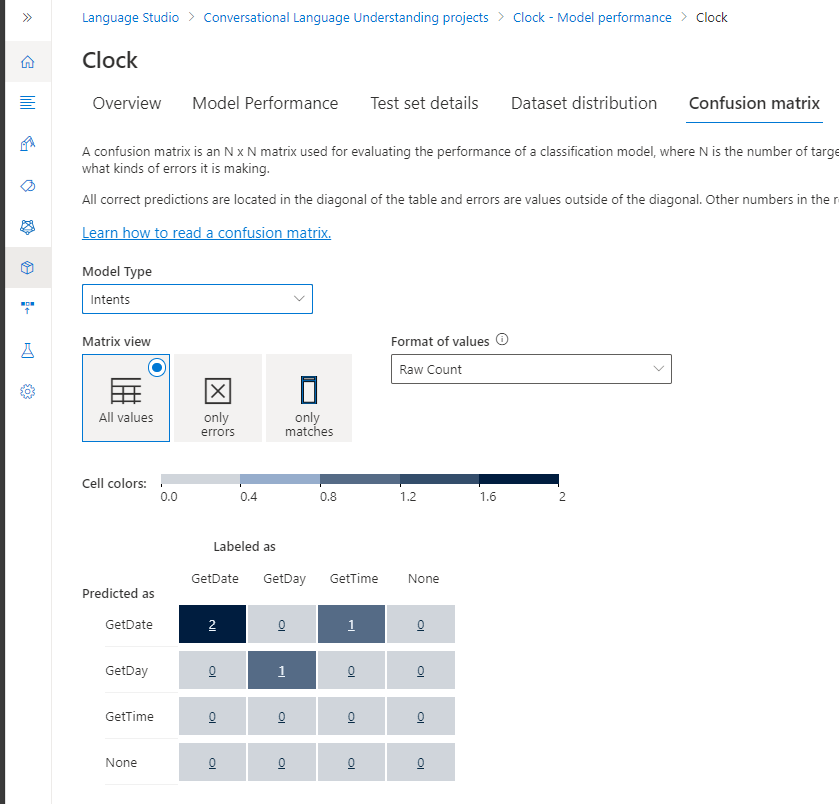
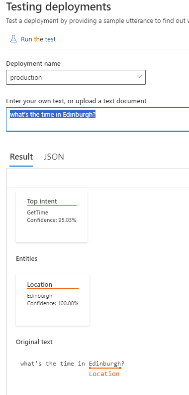

# [Create a Language Understanding solution with Azure AI Language](https://learn.microsoft.com/en-us/training/paths/create-language-solution-azure-cognitive-services/)

## [Build a conversational language understanding model](https://learn.microsoft.com/en-us/training/modules/build-language-understanding-model/)

### Understand resources for building a conversational language understanding model
* To use the Language Understanding service to develop an NLP solution, create a Language resource in Azure. It will be used for both authoring your model and processing prediction requests from client applications.
* Azure AI Language has various features, including sentiment analysis, key phrase extraction, entity recognition, intent recognition, and text classification. 
* Some features, such as conversational language understanding and custom named entity recognition require a model to be built for prediction.
* Build your model
  1. For features that require a model for prediction - build, train and deploy that model before using it to make a prediction. This building and training will teach the Azure AI Language service what to look for.
  1. Portal -> Azure AI services -> Language Service -> Create -> Need a key and the endpoint
* Use the REST API - One way to build your model
  1. The pattern would be to create your project, import data, train, deploy, then use your model.
  1. These tasks are done asynchronously; submit a request to the appropriate URI for each step, and then send another request to get the status of that job.
  1. Example, if deploy a model for a conversational language understanding project, you'd submit the deployment job, and then check on the deployment job status.
* Authentication - providing the following header. Key	-> Ocp-Apim-Subscription-Key,  Value -> The key to your resource
* Request deployment
  1. Submit a POST request to the following endpoint.
    ```
    {ENDPOINT}/language/authoring/analyze-conversations/projects/{PROJECT-NAME}/deployments/{DEPLOYMENT-NAME}?api-version={API-VERSION}
    ```
  | Placeholder |	Value |	Example |
  |--|--|--|
  | {ENDPOINT} | The endpoint of your Azure AI Language resource |	https://<your-subdomain>.cognitiveservices.azure.com |
  | {PROJECT-NAME} | The name for your project. This value is case-sensitive |		myProject |
  | {DEPLOYMENT-NAME} | The name for your deployment. This value is case-sensitive |		staging |
  | {API-VERSION} | The version of the API you're calling |		2022-05-01 |
  
  1. Include the following body with your request. {MODEL-NAME} - 	The model name that will be assigned to your deployment. This value is case-sensitive.
    ```
    {
      "trainedModelLabel": "{MODEL-NAME}",
    }
    ```
  1. Successfully submitting your request will receive a 202 response, with a response header of operation-location. This header will have a URL with which to request the status, formatted like this:
    ```
    {ENDPOINT}/language/authoring/analyze-conversations/projects/{PROJECT-NAME}/deployments/{DEPLOYMENT-NAME}/jobs/{JOB-ID}?api-version={API-VERSION}
    ```
  1. Get deployment status - Submit a GET request to the URL from the response header above. 
    ```
    {ENDPOINT}/language/authoring/analyze-conversations/projects/{PROJECT-NAME}/deployments/{DEPLOYMENT-NAME}/jobs/{JOB-ID}?api-version={API-VERSION}
    ```
    1. {ENDPOINT}	- The endpoint for authenticating your API request
    1. {PROJECT-NAME}	- The name for your project (case-sensitive)
    1. {DEPLOYMENT-NAME} -	The name for your deployment (case-sensitive)
    1. {JOB-ID}	- The ID for locating your model's training status, found in the header value detailed above in the deployment request
    1. {API-VERSION} -	The version of the API you're calling
  1. The response body will give the deployment status details. The status field will have the value of succeeded when the deployment is complete.
    ```
    {
        "jobId":"{JOB-ID}",
        "createdDateTime":"String",
        "lastUpdatedDateTime":"String",
        "expirationDateTime":"String",
        "status":"running"
    }
    ```
  1. [walkthrough with example, the conversational understanding quickstart.](https://learn.microsoft.com/en-us/azure/ai-services/language-service/conversational-language-understanding/quickstart?pivots=rest-api#create-a-clu-project)

* Use Language Studio
  1. Visual method of building, training, and deploying your model
  1. Choose to create a Conversational language understanding project. 
  1. Once the project is created, then go through the same process as above to build, train, and deploy your model.
  1. 

* Query your model
  1. To query your model for a prediction, create a POST request to the appropriate URL with the appropriate body specified. 
  1. For built in features such as language detection or sentiment analysis, you'll query the analyze-text endpoint.
    ```
    {ENDPOINT}/language/:analyze-text?api-version={API-VERSION}
    
      1. {ENDPOINT}	The endpoint for authenticating your API request
      2. {API-VERSION}	The version of the API you're calling
    ```
  1. Within the body of that request, you must specify the kind parameter, which tells the service what type of language understanding you're requesting.
  1. If you want to detect the language, for example, the JSON body would look something like the following.
    ```
    {
        "kind": "LanguageDetection",
        "parameters": {
            "modelVersion": "latest"
        },
        "analysisInput":{
            "documents":[
                {
                    "id":"1",
                    "text": "This is a document written in English."
                }
            ]
        }
    }
    ```
  1. A sample response to your query would be similar to the following.
    ```
    {
        "kind": "LanguageDetectionResults",
        "results": {
            "documents": [{
                "id": "1",
                "detectedLanguage": {
                    "name": "English",
                    "iso6391Name": "en",
                    "confidenceScore": 1.0
                },
                "warnings": []
            }],
            "errors": [],
            "modelVersion": "{VERSION}"
        }
    }
    ```
  1. Other language features, such as the conversational language understanding discussed above, require the request be routed to a different endpoint. 
  1. For example, the conversational language understanding request would be sent to the following.
    ```
    {ENDPOINT}/language/:analyze-conversations?api-version={API-VERSION}
      1. {ENDPOINT}	The endpoint for authenticating your API request
      2. {API-VERSION}	The version of the API you're calling
    ```
  1. That request would include a JSON body similar to the following.
    ```
    {
      "kind": "Conversation",
      "analysisInput": {
        "conversationItem": {
          "id": "1",
          "participantId": "1",
          "text": "Sample text"
        }
      },
      "parameters": {
        "projectName": "{PROJECT-NAME}",
        "deploymentName": "{DEPLOYMENT-NAME}",
        "stringIndexType": "TextElement_V8"
      }
    }
    
      1. {PROJECT-NAME}	The name of the project where you built your model
      2. {DEPLOYMENT-NAME}	The name of your deployment
    ````
  1. A sample response to your query would be similar to the following.
    ```
    {
      "kind": "ConversationResult",
      "result": {
        "query": "String",
        "prediction": {
          "topIntent": "intent1",
          "projectKind": "Conversation",
          "intents": [
            {
              "category": "intent1",
              "confidenceScore": 1
            },
            {
              "category": "intent2",
              "confidenceScore": 0
            }
          ],
          "entities": [
            {
              "category": "entity1",
              "text": "text",
              "offset": 7,
              "length": 4,
              "confidenceScore": 1
            }
          ]
        }
      }
    }
    ```
  1. [documentation on features, examples and how-to guides, see the Azure AI Language pages.](https://learn.microsoft.com/en-us/azure/ai-services/language-service/)

### Define intents, utterances, and entities
* Utterances are the phrases that a user might enter when interacting with an application that uses your language model. 
* An intent represents a task or action the user wants to perform, or more simply the meaning of an utterance. 
* You create a model by defining intents and associating them with one or more utterances.
* For example, consider the following list of intents and associated utterances:
    ```
    GetTime:
      "What time is it?"
      "What is the time?"
      "Tell me the time"
    GetWeather:
      "What is the weather forecast?"
      "Do I need an umbrella?"
      "Will it snow?"
    TurnOnDevice
      "Turn the light on."
      "Switch on the light."
      "Turn on the fan"
    None:
      "Hello"
      "Goodbye"
    ```
* In your model, must define the intents that you want your model to understand, your model must support and the kinds of actions or information that users might request. 
* In addition to the intents that you define, every model includes a None intent that you should use to explicitly identify utterances that a user might submit, but for which there is no specific action required (for example, conversational greetings like "hello") or that fall outside of the scope of the domain for this model.
* After you've identified the intents your model must support, it's important to capture various different example utterances for each intent. Collect utterances that you think users will enter; including utterances meaning the same thing but that are constructed in different ways. Keep these guidelines in mind:
  1. Capture multiple different examples, or alternative ways of saying the same thing
  1. Vary the length of the utterances from short, to medium, to long
  1. Vary the location of the noun or subject of the utterance. Place it at the beginning, the end, or somewhere in between
  1. Use correct grammar and incorrect grammar in different utterances to offer good training data examples
  1. The precision, consistency and completeness of your labeled data are key factors to determining model performance.
      1. Label precisely: Label each entity to its right type always. Only include what you want extracted, avoid unnecessary data in your labels.
      1. Label consistently: The same entity should have the same label across all the utterances.
      1. Label completely: Label all the instances of the entity in all your utterances.
* Entities are used to add specific context to intents. 
  1. For example, you might define a TurnOnDevice intent that can be applied to multiple devices, and use entities to define the different devices.
  1. Consider the following utterances, intents, and entities:

  | Utterance	| Intent	| Entities |
  |--|--|--|
  | What is the time?	| GetTime |	 |
  | What time is it in London?	| GetTime	| Location (London) |
  | What's the weather forecast for Paris?	| GetWeather	| Location (Paris) |
  | Will I need an umbrella tonight?	| GetWeather	| Time (tonight) |
  | What's the forecast for Seattle tomorrow?	| GetWeather	| Location (Seattle), Time (tomorrow) |
  | Turn the light on.	| TurnOnDevice	| Device (light) |
  | Switch on the fan.	| TurnOnDevice	| Device (fan) |

* You can split entities into a few different component types:
  1. Learned entities are the most flexible kind of entity, and should be used in most cases. You define a learned component with a suitable name, and then associate words or phrases with it in training utterances. When you train your model, it learns to match the appropriate elements in the utterances with the entity.
  1. List entities are useful when you need an entity with a specific set of possible values - for example, days of the week. You can include synonyms in a list entity definition, so you could define a DayOfWeek entity that includes the values "Sunday", "Monday", "Tuesday", and so on; each with synonyms like "Sun", "Mon", "Tue", and so on.
  1. Prebuilt entities are useful for common types such as numbers, datetimes, and names. For example, when prebuilt components are added, you will automatically detect values such as "6" or organizations such as "Microsoft". You can see this article for a list of supported prebuilt entities.

### Use patterns to differentiate similar utterances
* In some cases, a model might contain multiple intents for which utterances are likely to be similar. 
* You can use the pattern of utterances to disambiguate the intents while minimizing the number of sample utterances.
* For example, consider the following utterances:
    1. "Turn on the kitchen light"
    1. "Is the kitchen light on?"
    1. "Turn off the kitchen light"
* These utterances are syntactically similar, with only a few differences in words or punctuation. 
* However, they represent three different intents (which could be named TurnOnDevice, GetDeviceStatus, and TurnOffDevice). 
* Additionally, the intents could apply to a wide range of entity values. 
* In addition to "kitchen light", the intent could apply to "living room light", television", or any other device that the model might need to support.
* To correctly train your model, provide a handful of examples of each intent that specify the different formats of utterances.
    ```
    TurnOnDevice:
      "Turn on the {DeviceName}"
      "Switch the {DeviceName} on"
      "Turn on the {DeviceName}"
    GetDeviceStatus:
      "Is the {DeviceName} on[?]"
    TurnOffDevice:
      "Turn the {DeviceName} off"
      "Switch off the {DeviceName}"
      "Turn off the {DeviceName}"
    ```
* When you teach your model with each different type of utterance, the Azure AI Language service can learn how to categorize intents correctly based off format and punctuation.

### Use pre-built entity components
* create your own language models by defining all the intents and utterances it requires, but often you can use prebuilt components to detect common entities such as numbers, emails, URLs, or choices.
* [For a full list of prebuilt entities the Azure AI Language service can detect](https://learn.microsoft.com/en-us/azure/ai-services/language-service/conversational-language-understanding/prebuilt-component-reference).
* Using prebuilt components allows you to let the Azure AI Language service automatically detect the specified type of entity, and not have to train your model with examples of that entity.
* To add a prebuilt component, you can create an entity in your project, then select Add new prebuilt to that entity to detect certain entities.
* 
* You can have up to five prebuilt components per entity. 
* Using prebuilt model elements can significantly reduce the time it takes to develop a conversational language understanding solution.

### rain, test, publish, and review a conversational language understanding model
* Creating a model is an iterative process with the following activities:
  1. Train a model to learn intents and entities from sample utterances.
  1. Test the model interactively or using a testing dataset with known labels
  1. Deploy a trained model to a public endpoint so client apps can use it
  1. Review predictions and iterate on utterances to train your model
* By following this iterative approach, you can improve the language model over time based on user input, helping you develop solutions that reflect the way users indicate their intents using natural language.

### [Exercise - Build an Azure AI services conversational language understanding model](https://microsoftlearning.github.io/mslearn-ai-language/Instructions/Labs/03-language-understanding.html)
* NOTE The conversational language understanding feature of the Azure AI Language service is currently in preview, and subject to change. In some cases, model training may fail - if this happens, try again.
* The Azure AI Language service enables you to define a conversational language understanding model that applications can use to interpret natural language input from users, predict the users intent (what they want to achieve), and identify any entities to which the intent should be applied.
* For example, a conversational language model for a clock application might be expected to process input such as:
  1. What is the time in London?
  1. This kind of input is an example of an utterance (something a user might say or type), for which the desired intent is to get the time in a specific location (an entity); in this case, London.
* NOTE The task of a conversational language model is to predict the user’s intent and identify any entities to which the intent applies. 
    1. It is not the job of a conversational language model to actually perform the actions required to satisfy the intent. 
    1. For example, a clock application can use a conversational language model to discern that the user wants to know the time in London; but the client application itself must then implement the logic to determine the correct time and present it to the user.

* Create an Azure AI Language resource - Portal -> Azure AI service -> Language Service -> Create.
* Create a conversational language understanding project
  1. Open the Language Studio portal at https://language.cognitive.azure.com/
  1. If prompted to choose a Language resource, select the following settings: Azure Directory, Azure subscription, Resource type: Language, Language resource.
  1. If not prompted, it may be because you have already assigned a different Azure AI Language resource; in which case:
    1. Settings (⚙) button -> Resources tab -> Select the language resource and select Switch resource -> select Language Studio to return home page.
  1. Create new menu -> select Conversational language understanding .
  1. Create a project dialog box, Enter -> Name, Description, Utterances primary language: English, Enable multiple languages in project?: Unselected -> Create.  
  1. Create intents - The first thing we’ll do in the new project is to define some intents.
    1. Schema definition page -> Intents tab -> select ＋ Add to add a new intent named GetTime.
    1. Select the new GetTime intent to edit it, add the following utterances as example user input: what is the time?, what's the time?, what time is it?, tell me the time
    1. After you’ve added these utterances, select Save changes and go back to the Schema definition page.
    1. Add another new intent named GetDay with the following utterances: what day is it?, what's the day?, what is the day today?, what day of the week is it?
    1. Add another new intent named GetDate with the following utterances: what date is it?, what's the date?, what is the date today?, what's today's date?
* Train and test the model
  1. train the language model and see if it can correctly predict them from user input.
  1. Left Pane -> Training jobs -> Start a training job -> train a new model (name: Clock) -> Train button -> (take mins) Complete Status change to succeeded.
  1. Model performance -> select the Clock model -> Review the overall, per-intent evaluation and the confusion matrix.
  1. 
  1. Deploying a model page -> Add deployment -> Deployment name (production), Select the Clock model -> Deploy (take mins)
  1. Testing deployments page -> production deployment -> Enter the text & run: what's the time now? Try more tell me the time, what's the day today?
  1. Review the result - the predicted intent (which should be GetTime), a confidence score (calculated for the predicted intent). The JSON tab shows the comparative confidence for each potential intent (the one with the highest confidence score is the predicted intent)
  1.  |  

* Add entities
  1. Defined some simple utterances that map to intents. Most real applications include more complex utterances from which specific data entities must be extracted to get more context for the intent.
  1. Add a learned entity
    1. The most common kind of entity is a learned entity, in which the model learns to identify entity values based on examples.
    1. Schema definition page -> Entities -> add a new entity -> entity name (Location), the Learned tab is selected -> Add entity.
    1. Schema definition page -> Intents -> GetTime intent -> utterance: what time is it in London?, Tell me the time in Paris?, what's the time in New York?
    1. When the utterance has been added, select the word London, and in the drop-down list that appears, select Location to indicate that “London” is an example of a location. Same as  Paris, New York
    1. 
    1. Save.

* Add a list entity
  1. In some cases, valid values for an entity can be restricted to a list of specific terms and synonyms; which can help the app identify instances of the entity in utterances.
  1. Schema definition -> Entities -> add a new entity (name: Weekday) -> select the List entity -> Add.
  1. Select Weekday entity ->  List section -> Add new list 

      | List key | synonyms | 
      |--|--|
      | Sunday	| Sun | 
      | Monday	| Mon | 
      | Tuesday	| Tue, Tues | 
      | Wednesday	| Wed, Weds | 
      | Thursday	| Thur, Thurs | 
      | Friday	| Fri | 
      | Saturday	| Sat | 
  1. Schema definition page -> Intents -> select the GetDate intent -> Add utterance
    1. what date was it on Saturday? (select Saturday word -> drop-down list that appears -> select Weekday)
    1. what date will it be on Friday? (Friday),  what will the date be on Thurs? (Thurs)
  1. Save changes

* Add a prebuilt entity
  1. The Azure AI Language service provides a set of prebuilt entities that are commonly used in conversational applications.
  1. Schema definition -> Entities -> New entity (Date) -> select the Prebuilt entity tab -> Add entity.
  1. Date entity -> Prebuilt section -> Add new prebuilt ->  select DateTime -> Save.
  1. Schema definition -> Intents -> GetDay -> utterance: what day was 01/01/1901? (01/01/1901 map Date), what day will it be on Dec 31st 2099? (Dec 31st 2099) -> Save

* Retrain the model
  1. Training jobs -> Start a training job -> overwrite an existing model (Clock model) -> Train -> confirm overwrite -> job Status succeeded.
  1. Model performance -> select the Clock model -> Review the evaluation metrics and the confusion matrix
  1.  | 
  1. Deploying a model page -> Add deployment -> Override an existing deployment name (production) -> Select the Clock model -> Deploy to deploy it
  1. When the model is deployed, Testing deployments -> select the production -> test
    1. what's the time in Edinburgh? -> Review the result, predict the GetTime intent and a Location entity with the text value “Edinburgh”.
    1. 
    1. Try testing the following utterances: what time is it in Tokyo?, what date is it on Friday?, what's the date on Weds?, what day was 01/01/2020?, what day will Mar 7th 2030 be?
    1. 

* Use the model from a client app
  1. In a real project, you’d iteratively refine intents and entities, retrain, and retest until you are satisfied with the predictive performance. 
  1. Then, when you’ve tested it and are satisfied with its predictive performance, you can use it in a client app by calling its REST interface. 
  1. Deploying a model page -> select the production deployment -> select Get prediction URL
  1. 
  1. ai-language/09-language-app -> send-call.sh (qn: “What’s the time in Sydney?”) -> Replace: ENDPOINT_URL, YOUR_KEY, REQUEST_ID -> Run "sh send-call.sh" or postman
  1. 
  1. Try the following queries: What day will Jan 1st 2050 be?, What time is it in Glasgow?, What date will next Monday be?

* Export the project
  1. use Language Studio to develop and test model, but in a software development process, maintain a source controlled & CI/CD pipelines. 
  1. Can use the Azure AI Language REST API to create and train the model, a simpler way is to use the portal to create the model schema, and export it as a .json file that can be imported and retrained in another Azure AI Language instance. 
  1. This approach enables you to make use of the productivity benefits of the Language Studio visual interface while maintaining portability and reproducibility for the model.
    1. Select theProjects tab -> select the Clock project -> ⤓ Export button -> Save the Clock.json -> Review

### Quiz
1. Your app must interpret a command such as "turn on the light" or "switch the light on". What do these phrases represent in a language model? 
  1. [ ] Intents.
  1. [x] Utterances.
  1. [ ] Entities.
2. Your app must interpret a command to book a flight to a specified city, such as "Book a flight to Paris." How should you model the city element of the command? 
  1. [ ] As an intent.
  1. [ ] As an utterance.
  1. [x] As an entity.
3. Your language model needs to detect an email when present in an utterance. What is the simplest way to extract that email? 
  1. [ ] Use Regular Expression entities.
  1. [x] Use prebuilt entity components.
  1. [ ] Use Learned entity components.

## [Publish and use an Azure AI Language Understanding app](https://learn.microsoft.com/en-us/training/modules/publish-use-language-understand-app/)
* After creating an Azure AI Language Understanding app, you can publish it and consume it from client applications.

### Understand capabilities of the Azure AI Language service
* The Azure AI Language service provides various features for understanding human language. A client application can use each feature to better communicate with users, or use them together to provide more insight into what the user is saying, intending, and asking about.
* Azure AI Language service features fall into two categories: Pre-configured features, and Learned features. Learned features require building and training a model to correctly predict appropriate labels.
* The endpoint used to query a specific feature varies: https://{ENDPOINT}/text/analytics/{VERSION}/{FEATURE}
  | Placeholder| 	Value| Example |
  |--|--|--|
  | {ENDPOINT}| The endpoint for authenticating your API request.  | For example, myLanguageService.cognitiveservices.azure.com| 
  | {VERSION}	| The version number of the service you want to call.  | For example, v3.0  |
  | {FEATURE}	| The feature you're submitting the query to.  | For example, keyPhrases for key phrase detection  |

* Pre-configured features - The Azure AI Language service provides certain features without any model labeling or training. The following features are all pre-configured.
    1. Summarization - endpoint with the extractiveSummarizationTasks or ConversationalSummarizationTask  /{ENDPOINT}/text/analytics/{VERSION}/analyze
        1. It's available for both documents and conversations, and will summarize the text into key sentences that are predicted to encapsulate the input's meaning.
    1. Named entity recognition - endpoint with the EntityRecognition : /{ENDPOINT}/language/:analyze-text?api-version={VERSION}
        1. It can extract and identify entities (people, places, or companies), to recognize different types of entities for improved natural language responses. 
        1. For example, given the text "The waterfront pier is my favorite Seattle attraction", Seattle would be identified and categorized as a location.
    1. Personally identifiable information (PII) detection - endpoint with the PiiEntityRecognition : /{ENDPOINT}/language/:analyze-text?api-version={VERSION}
        1. It allows you to identify, categorize, and redact sensitive info (email addresses, home addresses, IP addresses, names, and protected health info). 
        1. For example, if the text "email@contoso.com" was included in the query, the entire email address can be identified and redacted.
    1. Key phrase extraction - endpoint with the KeyPhraseExtraction /{ENDPOINT}/language/:analyze-text?api-version={VERSION}
        1. It is a feature that quickly pulls the main concepts out of the provided text. 
        1. Example, given the text "Text Analytics is one of the features in Azure AI Services.", the service would extract "Azure AI Services" and "Text Analytics".
    1. Sentiment analysis - endpoint with the SentimentAnalysis /{ENDPOINT}/language/:analyze-text?api-version={VERSION}
        1. It identifies how positive or negative a string or document is. 
        1. Example, given the text "Great hotel. Close to plenty of food and attractions we could walk to", identify as +ve with a relatively high confidence score.
    1. Language detection - endpoint with the LanguageDetection: /{ENDPOINT}/language/:analyze-text?api-version={VERSION}
        1. It takes one or more documents, and identifies the language for each. 
        1. Example, if the text of one of the documents was "Bonjour", the service would identify that as French.
* Learned features
    1. It require you to label data, train, and deploy your model to make it available to use in your application. These features allow you to customize what information is predicted or extracted.
    1. Note: Quality of data greatly impacts the model's accuracy. Be intentional about what data is used, how well it is tagged or labeled, and how varied the training data is. [Rrecommendations & guidelines](https://learn.microsoft.com/en-us/azure/ai-services/language-service/conversational-language-understanding/how-to/tag-utterances?tabs=portal)
    1. Conversational language understanding (CLU)
        1. CLU is one of the core custom features offered by Azure AI Language. 
        1. CLU helps users to build custom natural language understanding models to predict overall intent and extract important information from incoming utterances.
        1. CLU does require data to be tagged by the user to teach it how to predict intents and entities accurately.
        1. Endpoint with the task specified as Conversation. These custom features require extra parameters in the JSON body, including the projectName and deploymentName of your model. /{ENDPOINT}/language/:analyze-conversations?api-version={VERSION}
    1. Custom named entity recognition
        1. It takes custom labeled data and extracts specified entities from unstructured text. 
        1. For example, if you have various contract documents that you want to extract involved parties from, you can train a model to recognize how to predict them.
        1. Endpoint with the task specified as CustomEntityRecognition. This custom feature also require extra parameters in the JSON body, including the projectName and deploymentName of your model. /{ENDPOINT}/language/analyze-text/jobs?api-version={VERSION}
    1. Custom text classification
        1. It enables users to classify text or documents as custom defined groups. 
        1. For example, you can train a model to look at news articles and identify the category they should fall into, such as News or Entertainment.
        1. Endpoint with the CustomMultiLabelClassification or CustomSingleLabelClassification depending on single or multi label classification. Require extra parameters in the JSON body, including the projectName and deploymentName of your model. /{ENDPOINT}/language/analyze-text/jobs?api-version={VERSION}
    1. Question answering
        1. It's a mostly pre-configured feature that provides answers to questions provided as input. The data to answer these questions comes from documents like FAQs or manuals.
        1. For example, say you want to make a virtual chat assistant on your company website to answer common questions. You could use a company FAQ as the input document to create the question and answer pairs. Once deployed, your chat assistant can pass input questions to the service, and get the answers as a result.
        1. The endpoint {ENDPOINT}/language/:query-knowledgebases?projectName={PROJECTNAME}&deploymentName={DEPLOYMENTNAME}&api-version={VERSION}
            1. {PROJECTNAME}	The name of your project where you provided documents as data to answer questions
            1. {DEPLOYMENTNAME}	The name of your deployment

### Process predictions
* Regardless of the approach used, requests for predictions are sent to your Azure AI Language service and include the following parameters:
  1. kind - indicates which language feature you're requesting. For example, kind is defined as Conversation for conversational language understanding, or EntityRecognition to detect entities
  1. parameters - indicates the values for various input parameters. These parameters vary depending on the feature. For example, projectName and deploymentName are required for conversational language understanding, however only modelVersion is needed for language detection or entity recognition.
  1. analysis input - specifies the input documents or text strings to be analyzed by the Azure AI Language service.
* Prediction results - consist of a hierarchy of information that your application must parse. A typical JSON response might look similar to the following:
    ```
    {
      "kind": "ConversationResult",
      "result": {
        "query": "What's the time in Edinburgh?",
        "prediction": {
          "topIntent": "GetTime",
          "projectKind": "Conversation",
          "intents": [
            {
              "category": "GetTime",
              "confidenceScore": 1
            },
            {
              "category": "GetDate",
              "confidenceScore": 0.1
            }
          ],
          "entities": [
            {
              "text": "Edinburgh",
              "category": "Location",
              "subcategory": "GPE",
              "offset": 19,
              "length": 9,
              "confidenceScore": 1.0
            }
          ]
        }
      }
    }
    ```
  1. The prediction results include the query utterance, the top (most likely) intent, other potential intents with their respective confidence score, and the entities that were detected. 
  1. Each entity includes a category and subcategory (when applicable) in addition to its confidence score (for example, "Edinburgh", which was detected as a location with confidence of 1.0). 
  1. The results may also include any other intents that were identified as a possible match, and details about the location of each entity in the utterance string.
  1. Note: It's important to emphasize that the Azure AI Language Understanding service enables your application to identify the intent of the user (in this case to find out the current time in Edinburgh). It is the responsibility of the client application to then perform whatever logic is necessary to fulfill the intent (so the Azure AI Language understanding model does not return the actual time in Edinburgh - it simply indicates to the client application that this is the information that the user wants.)

### Exercise - Create a Language Service Client Application
* ai-language/Labfiles/03b-language-app
* use Clock project OR Import Clock.json -> Get prediction URL endpoint
* Portal -> Language service resource -> Get KEY 1 and Endpoint.
* Prepare to use the Language service SDK
  1. 10b-clu-client-(preview)
  ```
    C#
     dotnet add package Azure.AI.Language.Conversations --version 1.1.0
     dotnet add package Azure.Core
  
     // Import namespaces
     using Azure;
     using Azure.AI.Language.Conversations;
      
    Python
     pip install azure-ai-language-conversations
     python -m pip install python-dotenv
     python -m pip install python-dateutil
 
     # Import namespaces
     from azure.core.credentials import AzureKeyCredential
     from azure.ai.language.conversations import ConversationAnalysisClient
  ```
  
  2. Get a prediction from the Conversational Language model
  ```
  C#
   // Create a client for the Language service model
   Uri endpoint = new Uri(predictionEndpoint);
   AzureKeyCredential credential = new AzureKeyCredential(predictionKey);
  
   ConversationAnalysisClient client = new ConversationAnalysisClient(endpoint, credential);
  
  Python
   # Create a client for the Language service model
   client = ConversationAnalysisClient(
       ls_prediction_endpoint, AzureKeyCredential(ls_prediction_key))
  
  C#
   // Call the Language service model to get intent and entities
   var projectName = "Clock";
   var deploymentName = "production";
   var data = new
   {
       analysisInput = new
       {
           conversationItem = new
           {
               text = userText,
               id = "1",
               participantId = "1",
           }
       },
       parameters = new
       {
           projectName,
           deploymentName,
           // Use Utf16CodeUnit for strings in .NET.
           stringIndexType = "Utf16CodeUnit",
       },
       kind = "Conversation",
   };
   // Send request
   Response response = await client.AnalyzeConversationAsync(RequestContent.Create(data));
   dynamic conversationalTaskResult = response.Content.ToDynamicFromJson(JsonPropertyNames.CamelCase);
   dynamic conversationPrediction = conversationalTaskResult.Result.Prediction;   
   var options = new JsonSerializerOptions { WriteIndented = true };
   Console.WriteLine(JsonSerializer.Serialize(conversationalTaskResult, options));
   Console.WriteLine("--------------------\n");
   Console.WriteLine(userText);
   var topIntent = "";
   if (conversationPrediction.Intents[0].ConfidenceScore > 0.5)
   {
       topIntent = conversationPrediction.TopIntent;
   }
  
  Python
   # Call the Language service model to get intent and entities
   cls_project = 'Clock'
   deployment_slot = 'production'
  
   with client:
       query = userText
       result = client.analyze_conversation(
           task={
               "kind": "Conversation",
               "analysisInput": {
                   "conversationItem": {
                       "participantId": "1",
                       "id": "1",
                       "modality": "text",
                       "language": "en",
                       "text": query
                   },
                   "isLoggingEnabled": False
               },
               "parameters": {
                   "projectName": cls_project,
                   "deploymentName": deployment_slot,
                   "verbose": True
               }
           }
       )
  
   top_intent = result["result"]["prediction"]["topIntent"]
   entities = result["result"]["prediction"]["entities"]
  
   print("view top intent:")
   print("\ttop intent: {}".format(result["result"]["prediction"]["topIntent"]))
   print("\tcategory: {}".format(result["result"]["prediction"]["intents"][0]["category"]))
   print("\tconfidence score: {}\n".format(result["result"]["prediction"]["intents"][0]["confidenceScore"]))
  
   print("view entities:")
   for entity in entities:
       print("\tcategory: {}".format(entity["category"]))
       print("\ttext: {}".format(entity["text"]))
       print("\tconfidence score: {}".format(entity["confidenceScore"]))
  
   print("query: {}".format(result["result"]["query"]))

  C#
   // Apply the appropriate action
   switch (topIntent)
   {
       case "GetTime":
           var location = "local";           
           // Check for a location entity
           foreach (dynamic entity in conversationPrediction.Entities)
           {
               if (entity.Category == "Location")
               {
                   //Console.WriteLine($"Location Confidence: {entity.ConfidenceScore}");
                   location = entity.Text;
               }
           }
           // Get the time for the specified location
           string timeResponse = GetTime(location);
           Console.WriteLine(timeResponse);
           break;
       case "GetDay":
           var date = DateTime.Today.ToShortDateString();            
           // Check for a Date entity
           foreach (dynamic entity in conversationPrediction.Entities)
           {
               if (entity.Category == "Date")
               {
                   //Console.WriteLine($"Location Confidence: {entity.ConfidenceScore}");
                   date = entity.Text;
               }
           }            
           // Get the day for the specified date
           string dayResponse = GetDay(date);
           Console.WriteLine(dayResponse);
           break;
       case "GetDate":
           var day = DateTime.Today.DayOfWeek.ToString();
           // Check for entities            
           // Check for a Weekday entity
           foreach (dynamic entity in conversationPrediction.Entities)
           {
               if (entity.Category == "Weekday")
               {
                   //Console.WriteLine($"Location Confidence: {entity.ConfidenceScore}");
                   day = entity.Text;
               }
           }          
           // Get the date for the specified day
           string dateResponse = GetDate(day);
           Console.WriteLine(dateResponse);
           break;
       default:
           // Some other intent (for example, "None") was predicted
           Console.WriteLine("Try asking me for the time, the day, or the date.");
           break;
   }
  Python
  
  Code
   # Apply the appropriate action
   if top_intent == 'GetTime':
       location = 'local'
       # Check for entities
       if len(entities) > 0:
           # Check for a location entity
           for entity in entities:
               if 'Location' == entity["category"]:
                   # ML entities are strings, get the first one
                   location = entity["text"]
       # Get the time for the specified location
       print(GetTime(location))
  
   elif top_intent == 'GetDay':
       date_string = date.today().strftime("%m/%d/%Y")
       # Check for entities
       if len(entities) > 0:
           # Check for a Date entity
           for entity in entities:
               if 'Date' == entity["category"]:
                   # Regex entities are strings, get the first one
                   date_string = entity["text"]
       # Get the day for the specified date
       print(GetDay(date_string))
  
   elif top_intent == 'GetDate':
       day = 'today'
       # Check for entities
       if len(entities) > 0:
           # Check for a Weekday entity
           for entity in entities:
               if 'Weekday' == entity["category"]:
               # List entities are lists
                   day = entity["text"]
       # Get the date for the specified day
       print(GetDate(day))
  
   else:
       # Some other intent (for example, "None") was predicted
       print('Try asking me for the time, the day, or the date.')
  ```
* Enter utterances to test the application: Hello, What time is it?, What’s the time in London?, What’s the date?, What date is Sunday?, What day is it?, What day is 01/01/2025?


### Quiz
1. You want to filter reviews in your app to know how many people like or dislike a business. What feature would you use? 
  1. [x] Sentiment analysis
  1. [ ] Key phrase extraction
  1. [ ] Entity recognition
2. You want to get only the most likely intent for your natural language query. Which parameter should you use? 
  1. [ ] kind
  1. [ ] query
  1. [x] topIntent
